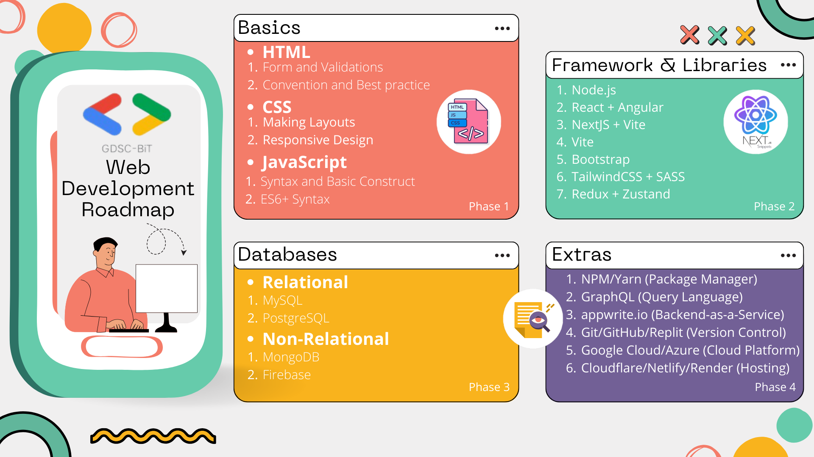

# Web Development

### [Roadmap](/WEB_DEV/assets/Roadmap.png)
- [ ] Phase 1 - `Basics`
    1. [HTML](https://developer.mozilla.org/en-US/docs/Web/HTML)
    2. [CSS](https://developer.mozilla.org/en-US/docs/Web/CSS)
    3. [JavaScript](https://developer.mozilla.org/en-US/docs/Web/JavaScript)
- [ ] Phase 2 - `Framework & Libraries`
    1. [Node.js](https://www.w3schools.com/nodejs)
    2. [React](https://www.w3schools.com/REACT/DEFAULT.ASP) + [Angular](https://www.w3schools.com/angular/)
    3. [NextJS](https://www.geeksforgeeks.org/next-js-introduction/) + [Vite](https://radixweb.com/introduction-of-vite-js)
    4. Bootstrap
        * [Bootstrap 3](https://www.w3schools.com/bootstrap/default.asp)
        * [Bootstrap 4](https://www.w3schools.com/bootstrap4/default.asp)
        * [Bootstrap 5](https://www.w3schools.com/bootstrap5/index.php)
    5. [TailwindCSS](https://www.geeksforgeeks.org/tailwind-css) + [SASS](https://www.w3schools.com/sass)
    6. [Redux](https://www.freecodecamp.org/news/what-is-redux-store-actions-reducers-explained/) + [Zustand](https://docs.pmnd.rs/zustand/getting-started/introduction)
- [ ] Phase 3 - `Databases`
    1. Relational
        * [MySQL](https://www.w3schools.com/MySQL/default.asp)
        * [PostreSQL](https://www.w3schools.com/postgresql/index.php)
    2. Non-Relational
        * [MongoDB](https://www.w3schools.com/mongodb)
        * [Firebase](https://firebase.google.com/docs)
- [ ] Phase 4 - `Extras`
    1. [npm](https://nodejs.dev/en/learn/an-introduction-to-the-npm-package-manager) + [yarn](https://yarnpkg.com/getting-started)
    2. [GraphQL](https://graphql.org/learn)
    3. [appwrite.io](https://appwrite.io)
    4. [Git](https://git-scm.com/about) + [GitHub](https://www.techtarget.com/searchitoperations/definition/GitHub) + [Replit](https://docs.replit.com/getting-started/intro-replit)
    5. [Google Cloud](https://cloud.google.com/docs/overview) + [Microsoft Azure](https://azure.microsoft.com/en-in/get-started)
- [ ] Phase 5 - `Deployment`
    1. [Cloudflare](https://www.cloudflare.com/learning/what-is-cloudflare) + [Netlify](https://www.netlify.com) *(Client hosting)*
    2. [Render](https://render.com) + [Vercel](https://vercel.com) + [Cyclic](https://www.cyclic.sh) *(Client & Server hosting)*
